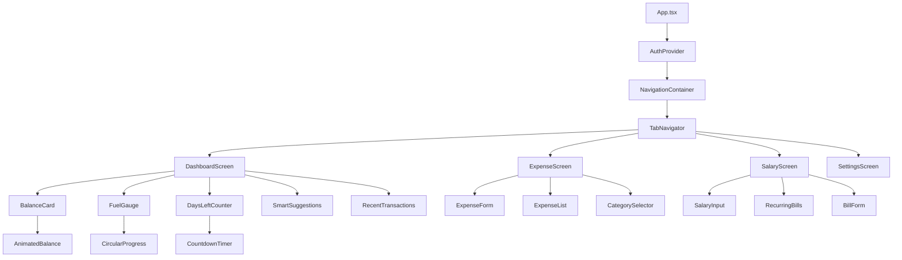
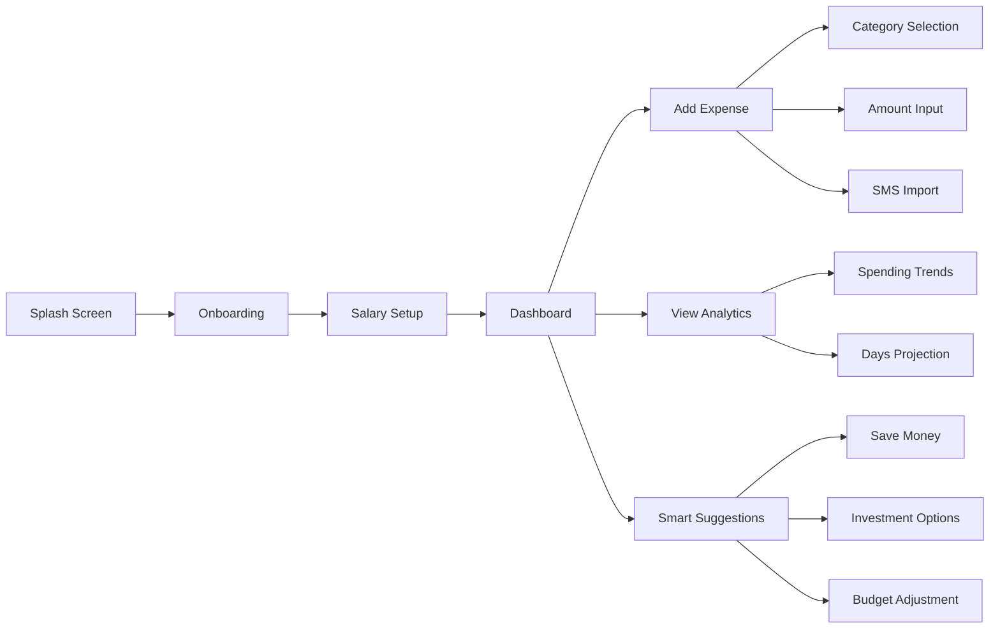
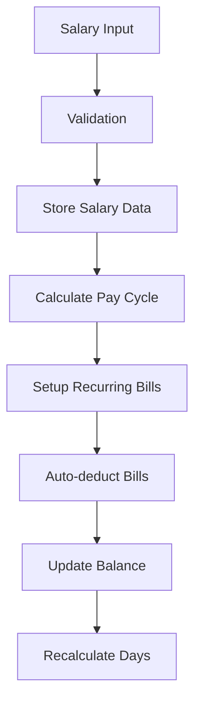
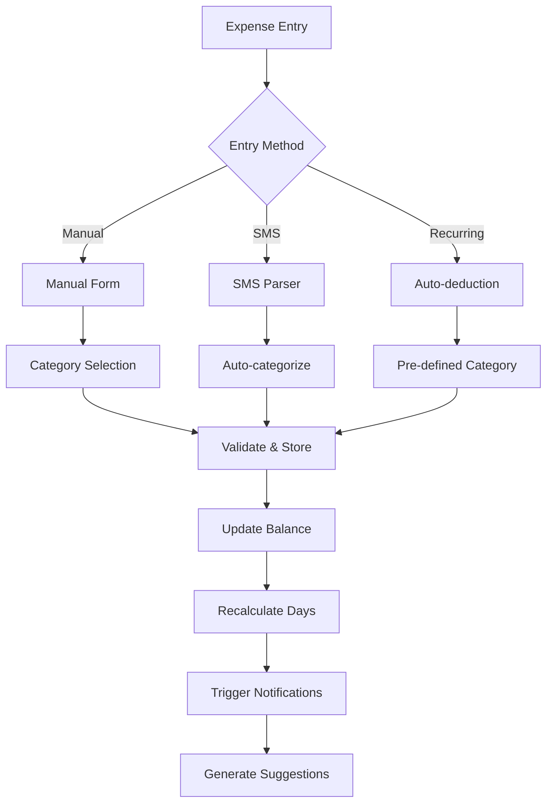

# React Native Expense Tracker App with Gamification

## Overview

A gamified React Native expense tracking application that transforms financial management into an engaging experience. The app treats money as "fuel" and visualizes how long a user's salary will last based on their spending patterns, with smart AI-powered suggestions for financial optimization.

### Core Value Proposition
- Gamified expense tracking with fuel metaphor
- Real-time calculation of "days remaining" based on spending
- Smart financial suggestions for optimal money allocation
- Automated recurring bill management
- SMS/bank transaction integration

## Technology Stack & Dependencies

### Core Framework
- **React Native**: Cross-platform mobile development
- **Expo**: Development platform and build toolchain
- **Expo Router**: File-based navigation system

### Styling & UI
- **NativeWind**: Tailwind CSS for React Native
- **React Native Reanimated**: Smooth animations for fuel gauge
- **React Native SVG**: Custom icons and fuel gauge graphics
- **Expo Vector Icons**: Icon library

### State Management & Storage
- **Zustand**: Lightweight state management
- **AsyncStorage**: Local data persistence
- **Expo SQLite** (Future upgrade): Enhanced local database

### Notifications & External Integration
- **Expo Notifications**: Push notifications and alerts
- **Expo SMS** (Optional): SMS reading capabilities
- **OpenAI API / OpenRouter**: AI-powered smart suggestions

### Development & Testing
- **TypeScript**: Type safety
- **Jest**: Unit testing framework
- **Detox**: End-to-end testing

## Component Architecture

### Component Hierarchy



### Core Components

#### Dashboard Components
```typescript
// BalanceCard Component
interface BalanceCardProps {
  currentBalance: number;
  salaryAmount: number;
  totalSpent: number;
  onRecharge: () => void;
}

// FuelGauge Component
interface FuelGaugeProps {
  percentage: number;
  animated?: boolean;
  size?: 'small' | 'medium' | 'large';
}

// DaysLeftCounter Component
interface DaysLeftCounterProps {
  daysRemaining: number;
  trend: 'up' | 'down' | 'stable';
}
```

#### Expense Management Components
```typescript
// ExpenseForm Component
interface ExpenseFormProps {
  onSubmit: (expense: ExpenseInput) => void;
  categories: Category[];
  suggestedAmount?: number;
}

// ExpenseList Component
interface ExpenseListProps {
  expenses: Expense[];
  onEdit: (expense: Expense) => void;
  onDelete: (id: string) => void;
  groupByDate?: boolean;
}
```

#### Smart Features Components
```typescript
// SmartSuggestions Component
interface SmartSuggestionsProps {
  availableBalance: number;
  spendingPattern: SpendingAnalytics;
  onActionTaken: (suggestion: Suggestion) => void;
}

// SMSParser Component
interface SMSParserProps {
  onExpenseDetected: (expense: ParsedExpense) => void;
  enableAutoAdd: boolean;
}
```

## Routing & Navigation

### Navigation Structure
```typescript
// Tab Navigator Configuration
const TabNavigator = () => (
  <Tab.Navigator
    screenOptions={{
      tabBarActiveTintColor: '#22c55e',
      tabBarInactiveTintColor: '#6b7280',
      tabBarStyle: {
        backgroundColor: '#111827',
        borderTopColor: '#374151',
      }
    }}
  >
    <Tab.Screen 
      name="Dashboard" 
      component={DashboardScreen}
      options={{
        tabBarIcon: ({ color }) => <Ionicons name="speedometer" color={color} />,
        headerTitle: 'Fuel Dashboard'
      }}
    />
    <Tab.Screen 
      name="Expenses" 
      component={ExpenseScreen}
      options={{
        tabBarIcon: ({ color }) => <Ionicons name="receipt" color={color} />
      }}
    />
    <Tab.Screen 
      name="Salary" 
      component={SalaryScreen}
      options={{
        tabBarIcon: ({ color }) => <Ionicons name="wallet" color={color} />
      }}
    />
    <Tab.Screen 
      name="Settings" 
      component={SettingsScreen}
      options={{
        tabBarIcon: ({ color }) => <Ionicons name="settings" color={color} />
      }}
    />
  </Tab.Navigator>
);
```

### Screen Flow Mapping


## Styling Strategy

### NativeWind Configuration
```javascript
// tailwind.config.js
module.exports = {
  content: ["./App.{js,jsx,ts,tsx}", "./src/**/*.{js,jsx,ts,tsx}"],
  theme: {
    extend: {
      colors: {
        fuel: {
          full: '#22c55e',
          medium: '#f59e0b',
          low: '#ef4444',
          empty: '#991b1b'
        },
        dark: {
          bg: '#111827',
          card: '#1f2937',
          border: '#374151'
        }
      }
    }
  },
  plugins: []
}
```

### Component Styling Patterns
```typescript
// Consistent styling approach
const styles = {
  container: "flex-1 bg-dark-bg px-4",
  card: "bg-dark-card rounded-xl p-4 mb-4 border border-dark-border",
  button: {
    primary: "bg-fuel-full py-3 px-6 rounded-lg",
    secondary: "bg-gray-600 py-3 px-6 rounded-lg",
    danger: "bg-fuel-low py-3 px-6 rounded-lg"
  },
  text: {
    heading: "text-white text-2xl font-bold",
    body: "text-gray-300 text-base",
    caption: "text-gray-400 text-sm"
  }
};
```

## State Management

### Zustand Store Architecture
```typescript
// Main App Store
interface AppStore {
  // User Profile
  user: UserProfile;
  setUser: (user: UserProfile) => void;
  
  // Financial Data
  salary: SalaryData;
  expenses: Expense[];
  recurringBills: RecurringBill[];
  
  // Calculated Values
  currentBalance: number;
  daysRemaining: number;
  averageDailySpend: number;
  
  // Actions
  setSalary: (amount: number, date: Date) => void;
  addExpense: (expense: ExpenseInput) => void;
  updateExpense: (id: string, expense: Partial<Expense>) => void;
  deleteExpense: (id: string) => void;
  addRecurringBill: (bill: RecurringBillInput) => void;
  
  // Calculations
  calculateBalance: () => number;
  calculateDaysRemaining: () => number;
  getSpendingAnalytics: () => SpendingAnalytics;
}

// Notification Store
interface NotificationStore {
  notifications: AppNotification[];
  settings: NotificationSettings;
  
  addNotification: (notification: NotificationInput) => void;
  markAsRead: (id: string) => void;
  updateSettings: (settings: Partial<NotificationSettings>) => void;
}

// AI Suggestions Store
interface SuggestionsStore {
  suggestions: Suggestion[];
  suggestionsHistory: Suggestion[];
  
  generateSuggestions: (context: FinancialContext) => Promise<void>;
  applySuggestion: (id: string) => void;
  dismissSuggestion: (id: string) => void;
}
```

### Data Models
```typescript
interface UserProfile {
  id: string;
  name: string;
  currency: string;
  timezone: string;
  onboardingCompleted: boolean;
}

interface SalaryData {
  amount: number;
  frequency: 'monthly' | 'weekly' | 'biweekly';
  lastUpdated: Date;
  nextSalaryDate: Date;
}

interface Expense {
  id: string;
  amount: number;
  category: ExpenseCategory;
  description: string;
  date: Date;
  source: 'manual' | 'sms' | 'recurring';
  tags?: string[];
}

interface RecurringBill {
  id: string;
  name: string;
  amount: number;
  frequency: 'monthly' | 'weekly' | 'yearly';
  nextDueDate: Date;
  category: ExpenseCategory;
  autoDeduct: boolean;
}

interface SpendingAnalytics {
  averageDailySpend: number;
  categoryBreakdown: { category: string; amount: number; percentage: number }[];
  monthlyTrend: { month: string; amount: number }[];
  projectedBurnRate: number;
}
```

## API Integration Layer

### External API Services
```typescript
// AI Suggestions Service
class AIService {
  private apiKey: string;
  private baseUrl: string;

  async generateSmartSuggestions(context: FinancialContext): Promise<Suggestion[]> {
    const prompt = this.buildPrompt(context);
    const response = await this.callAI(prompt);
    return this.parseAISuggestions(response);
  }

  private buildPrompt(context: FinancialContext): string {
    return `
      User Financial Context:
      - Current Balance: ${context.balance}
      - Days Remaining: ${context.daysLeft}
      - Monthly Salary: ${context.salary}
      - Average Daily Spend: ${context.avgDailySpend}
      - Top Categories: ${context.topCategories}
      
      Provide 3-5 actionable financial suggestions in JSON format.
    `;
  }
}

// SMS/Bank Transaction Parser
class TransactionParser {
  parseMessage(message: string): ParsedExpense | null {
    const patterns = [
      /(?:spent|debited|paid)\s*(?:rs\.?|₹)\s*(\d+(?:,\d{3})*(?:\.\d{2})?)/i,
      /(?:rs\.?|₹)\s*(\d+(?:,\d{3})*(?:\.\d{2})?)\s*(?:spent|debited|paid)/i
    ];
    
    for (const pattern of patterns) {
      const match = message.match(pattern);
      if (match) {
        return {
          amount: parseFloat(match[1].replace(/,/g, '')),
          description: this.extractDescription(message),
          category: this.inferCategory(message),
          source: 'sms'
        };
      }
    }
    return null;
  }
}
```

### Local Storage Service
```typescript
class StorageService {
  async saveExpenses(expenses: Expense[]): Promise<void> {
    await AsyncStorage.setItem('expenses', JSON.stringify(expenses));
  }

  async loadExpenses(): Promise<Expense[]> {
    const data = await AsyncStorage.getItem('expenses');
    return data ? JSON.parse(data) : [];
  }

  async saveSalaryData(salary: SalaryData): Promise<void> {
    await AsyncStorage.setItem('salary', JSON.stringify(salary));
  }

  async loadSalaryData(): Promise<SalaryData | null> {
    const data = await AsyncStorage.getItem('salary');
    return data ? JSON.parse(data) : null;
  }

  async clearAllData(): Promise<void> {
    const keys = ['expenses', 'salary', 'recurringBills', 'userProfile'];
    await AsyncStorage.multiRemove(keys);
  }
}
```

## Core Feature Architecture

### Salary Management System


### Expense Tracking Flow


### Gamification Logic
```typescript
class GamificationEngine {
  calculateFuelLevel(balance: number, salary: number): number {
    return Math.min(100, (balance / salary) * 100);
  }

  calculateDaysRemaining(balance: number, avgDailySpend: number): number {
    if (avgDailySpend === 0) return Infinity;
    return Math.floor(balance / avgDailySpend);
  }

  generateNotification(expense: Expense, previousDays: number, newDays: number): AppNotification {
    const daysDifference = previousDays - newDays;
    
    if (daysDifference >= 5) {
      return {
        type: 'warning',
        title: '🚨 Big Spend Alert!',
        message: `You just lost ${daysDifference} days of fuel! Days reduced from ${previousDays} → ${newDays}`,
        priority: 'high'
      };
    }
    
    return {
      type: 'info',
      title: '💰 Expense Added',
      message: `₹${expense.amount} spent on ${expense.category}`,
      priority: 'normal'
    };
  }

  checkAchievements(user: UserProfile, analytics: SpendingAnalytics): Achievement[] {
    const achievements: Achievement[] = [];
    
    // Savings streak
    if (analytics.savingsStreak >= 7) {
      achievements.push({
        id: 'savings_week',
        title: '🔥 Week Saver',
        description: 'Saved money for 7 consecutive days'
      });
    }
    
    // Budget master
    if (analytics.budgetAdherence >= 0.9) {
      achievements.push({
        id: 'budget_master',
        title: '🎯 Budget Master',
        description: 'Stayed within budget for the month'
      });
    }
    
    return achievements;
  }
}
```

### Smart Suggestions Algorithm
```typescript
class SuggestionEngine {
  generateSuggestions(context: FinancialContext): Suggestion[] {
    const suggestions: Suggestion[] = [];
    const { balance, daysLeft, salary, avgDailySpend } = context;
    
    // Emergency fund suggestion
    if (balance < salary * 0.1) {
      suggestions.push({
        type: 'emergency',
        title: '🚨 Emergency Mode',
        description: 'Consider reducing non-essential expenses',
        action: 'review_expenses',
        priority: 'high'
      });
    }
    
    // Investment suggestion
    if (balance > salary * 0.5 && daysLeft > 20) {
      suggestions.push({
        type: 'investment',
        title: '💎 Investment Opportunity',
        description: 'You have surplus funds. Consider investing ₹' + Math.floor(balance * 0.3),
        action: 'invest',
        priority: 'medium'
      });
    }
    
    // Savings suggestion
    if (daysLeft > 25) {
      suggestions.push({
        type: 'savings',
        title: '🏆 Great Job!',
        description: 'You\'re ahead of budget. Save ₹' + Math.floor(balance * 0.2),
        action: 'save',
        priority: 'low'
      });
    }
    
    return suggestions;
  }
}
```

## Testing Strategy

### Unit Testing Structure
```typescript
// Component Tests
describe('FuelGauge Component', () => {
  it('should display correct fuel level', () => {
    const { getByTestId } = render(<FuelGauge percentage={75} />);
    expect(getByTestId('fuel-percentage')).toHaveTextContent('75%');
  });
  
  it('should show warning color when fuel is low', () => {
    const { getByTestId } = render(<FuelGauge percentage={15} />);
    expect(getByTestId('fuel-gauge')).toHaveStyle({
      color: '#ef4444' // fuel-low color
    });
  });
});

// Store Tests
describe('App Store', () => {
  it('should calculate days remaining correctly', () => {
    const store = useAppStore.getState();
    store.setSalary(30000, new Date());
    store.addExpense({ amount: 1000, category: 'Food', description: 'Groceries' });
    
    expect(store.calculateDaysRemaining()).toBe(29); // Assuming 30-day month
  });
  
  it('should handle recurring bill deductions', () => {
    const store = useAppStore.getState();
    store.setSalary(30000, new Date());
    store.addRecurringBill({ 
      name: 'Rent', 
      amount: 10000, 
      frequency: 'monthly' 
    });
    
    expect(store.currentBalance).toBe(20000);
  });
});
```

### End-to-End Testing Scenarios
```typescript
// E2E Test Cases
describe('Expense Tracker E2E', () => {
  it('should complete onboarding flow', async () => {
    await device.launchApp();
    
    // Onboarding
    await expect(element(by.text('Welcome to Fuel Tracker'))).toBeVisible();
    await element(by.id('get-started-btn')).tap();
    
    // Salary setup
    await element(by.id('salary-input')).typeText('30000');
    await element(by.id('save-salary-btn')).tap();
    
    // Verify dashboard
    await expect(element(by.id('current-balance'))).toBeVisible();
    await expect(element(by.id('days-remaining'))).toBeVisible();
  });
  
  it('should add expense and update calculations', async () => {
    // Add expense
    await element(by.id('add-expense-btn')).tap();
    await element(by.id('amount-input')).typeText('500');
    await element(by.id('category-food')).tap();
    await element(by.id('save-expense-btn')).tap();
    
    // Verify updates
    await expect(element(by.id('current-balance'))).toHaveText('₹29,500');
    await expect(element(by.id('notification-badge'))).toBeVisible();
  });
});
```

### Performance Testing
```typescript
// Performance Benchmarks
describe('Performance Tests', () => {
  it('should calculate balance under 100ms for 1000 expenses', () => {
    const store = useAppStore.getState();
    const expenses = generateMockExpenses(1000);
    
    const startTime = performance.now();
    expenses.forEach(expense => store.addExpense(expense));
    const endTime = performance.now();
    
    expect(endTime - startTime).toBeLessThan(100);
  });
  
  it('should render expense list smoothly with 500 items', () => {
    const expenses = generateMockExpenses(500);
    const { getByTestId } = render(<ExpenseList expenses={expenses} />);
    
    // Test scroll performance
    fireEvent.scroll(getByTestId('expense-list'), {
      nativeEvent: { contentOffset: { y: 1000 } }
    });
    
    expect(getByTestId('expense-list')).toBeVisible();
  });
});
```


